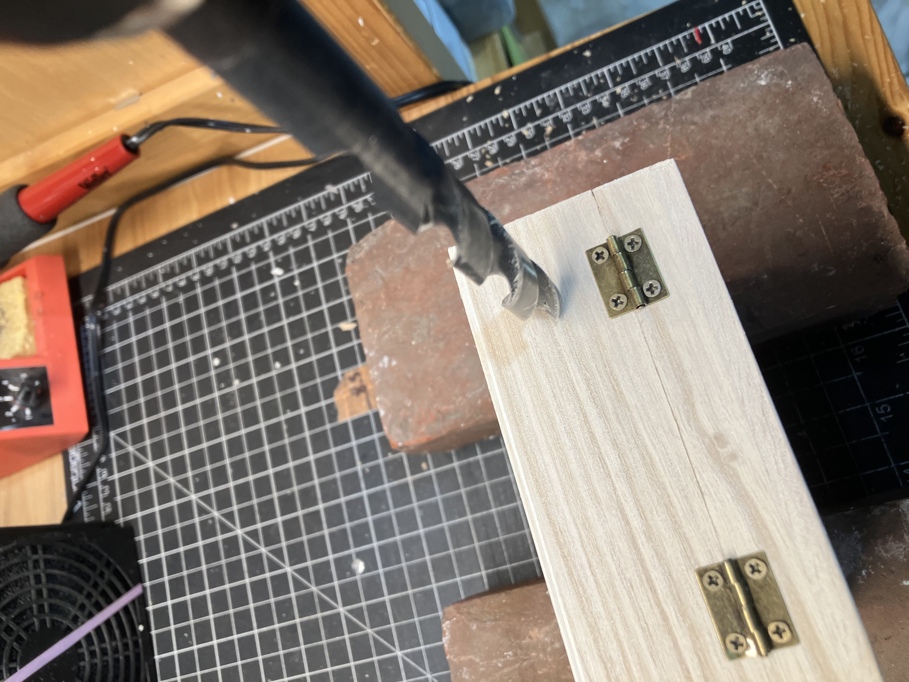
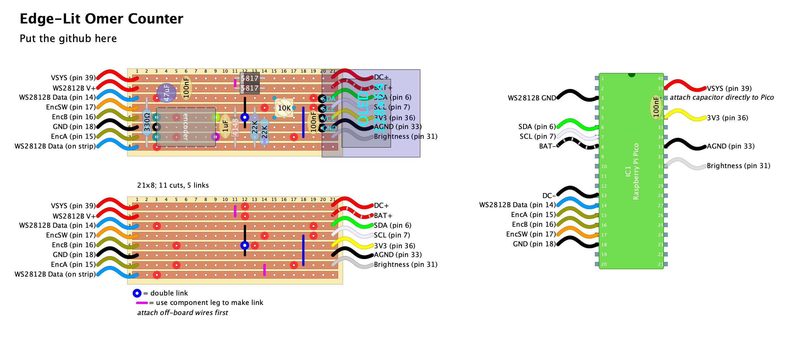

# Edge-Lit Omer Counter

## Objective
I designed this project to create an attractive reminder device for *sefirat ha-omer*. It does not have all the features that can be found in smartphone apps; my goals were to create an attractive physical device that would have an automatic timeout so it could provide a reminder on Shabbat/Yom Tov without requiring the user to interact directly with the device. The aesthetic concept took inspiration from [this video](https://www.youtube.com/watch?v=wuDAnHHIx6M&pp=ygUTZWxlbWVudDE0IGxlZCBzaWducw%3D%3D).

## Architecture
This project uses the Raspberry Pi Pico real-time clock (RTC) to generate an interrupt once per day. The interrupt routine advances the Omer count to the "next" day, lights up the etched design as a visual reminder to count, and displays the total count, weeks, and days on a standard 128x32 OLED display.

The trimpot voltage is read 10x/second, scaled to the range 40-255, and used to set the LED strip brightness (40 being the approximate minimum level that actually looked good).

When the display is active, the LED strip and OLED are updated 3x/second.

### Possible features someone else might want to add:
- Use Pico W to interface with HebCal (or other online API?) to automatically sync current time, Hebrew date, and nightfall
- Audio reminder 
- Text of blessing (would probably require a larger screen...)
- Make display timeouts configurable while active (currently hard-coded at 13s for quick view and 5h for alarm-triggered display)

## Materials
These are the materials I used for this project, with links to specific items where relevant. However, I did my best to design the project in ways that would allow flexibility in physical setup and design.

### Enclosure
- [Wooden box with clear lid](https://www.amazon.com/gp/product/B08DG97HP2/ref=ppx_od_dt_b_asin_title_s00?ie=UTF8&psc=1)
- [4" square plexiglass sheets](https://www.amazon.com/gp/product/B0BK5697J9/ref=ppx_od_dt_b_asin_title_s00?ie=UTF8&psc=1) – these are thin so I used 3 in a stack to get the right thickness relative to the LEDs
- 2xAAA battery holder + batteries as backup
- Some kind of 5VDC supply 

### Circuit components
- Raspberry Pi Pico
- Rotary encoder with switch
- WS2812B addressable LED strip (the box linked above will exactly fit a strip of 24 LEDs)
- 128x64 OLED display with I2C
- Trimpot (I used 10k but the actual value is not critical)
- LED for low battery indicator
- Diodes, resistors, capacitors, protoboard, wires , etc. (see schematic)

### Tools
- Scriber tool ([like this](https://www.amazon.com/gp/product/B081967TD3/ref=ppx_od_dt_b_asin_title_s00?ie=UTF8&psc=1)) or another way to etch the plexiglass. Dremel will work but may be overkill, especially on thinner sheets.
- Xacto or other project knife
- Metal straight edge
- Hot glue gun
- Drill (if you add an external DC connection)

## Code
the project code is broken into a few different modules for clarity and organization.
- `omer-counter:` main(), global variables and definitions, and interrupt/timer callbacks
- `omer-obj:` OmerCounter class and some data structures for handling Hebrew dates and the omer count. 
- `display:` Functions and variables to control the OLED and LED string. 
### Dependencies
This project requires [PicoLED](https://github.com/ForsakenNGS/PicoLED) to control the LED strip and [SSD1306_OLED_PICO](https://github.com/gavinlyonsrepo/SSD1306_OLED_PICO) for the screen output. Copy all the files from the PicoLED root into a new folder called lib/PicoLED (you do not need to copy PicoLED/Effects). For the SSD1306 library, copy the src/ and include/ folders into the SSD1306 folder that contains fonts/.

## Hardware Assembly
Here are the basic steps – I will add photos of the steps as I have a chance to take them.

### Drill Hole for DC jack
Put the whole wherever it makes sense – for mine, 0.75" up and 1" in from the bottom left corner of the back panel was about right – roughly in the middle of the hinge and halfway to the bottom. Make whatever size hole you need for the jacks you have.

     

There was a decent amount of tear-out so I hit the drill area with some 220-grit sandpaper to clean it up.

### Attach wires to LED strip
This will be much easier to do before you stick the strip down.

### Affix LED strip
The boxes I used perfectly fit a strip of 24 LEDs. As you look at the underside of the lid, first position the strip so that your wires are in one of the corners and the strip makes all the corners cleanly – no LEDs weirdly diagonal in a corner. Then peel the backing tape and stick the strip inside the lip of the box, so that all the LEDs are aimed back toward the middle of the box. The sticky tape on my strips didn't inspire a lot of confidence so I also slipped a little hot glue in to help it stay. I also put a glob of hot glue over the solder joint to protect against mechanical strain – the pads on these strips are easy to pull off and lose your connection.

### Add standoffs/spacers
The goal is to get it so the LEDs hit the plexiglass directly on the skinny edge. I used some old 2mm (5/64") basswood scraps and that was the right height, but it won't show in the finished product so anything that gets you the right offset will work.

### Assemble stripboard
There is a [full schematic](hardware/schematic-2.1.pdf) in the hardware/ folder. I made this stripboard layout (also found in hardware/) to connect all the components:

I chose **not** to use header pins to make everything a little more compact. Instead, I soldered wires directly to the Pico in the places indicated in the layout. Also note that the bypass capacitor on the 3.3V rail is soldered directly to the Pico at pins 36, 38.

Half of the wires on the stripboard are blocked by the OLED display so make sure you solder them onto the stripboard **before** you solder the OLED onto the board. 

### Affix hardware inside
Use your favorite method. I went with that nice foam double-sided tape.

### Make your design
[I put a design template in hardware/](hardware/design-template.svg). For the box i used, the outer quarter-inch or so of the plexiglass was blocked by the wood so i added the gray box to account for that overlap. Design it any way you want! For the supplies I used, I needed 3 sheets of the plexiglass to get the right overall thickness. If you're in a similar boat, you could etch your design onto one sheet and simply sandwich it between two others. I preferred to come up with a layered design and etch each plexiglass sheet with one layer of the total picture.

### Etch 3 pieces of plexi
If you're using the scriber-pens, it's literally as easy as tracing over the design. Experiment with more or less pressure and different stroke styles.

### Glue together
Take two of the plexiglass sheets and make sure they are aligned how you want them. Keeping the alignment in mind, slip a tiny bead of hot glue between the panels at a corner and get them realigned before the glue sets. The goal is to use a small enough bead of glue that it will stay on the edge where it's blocked by the wooden border. Repeat this step to affix the third sheet to the first two. If necessary, add glue in other corner(s) to secure all three panels in place.

### Glue to spacers
Use hot glue to attach your etched design to the spacers. **Make sure you have the front of the design facing out through the top of the box!** 

### Glue in paper backing
Print [the white cutout squares](hardware/white-square-cutout.pdf) on a piece of white card stock. *Make sure you are printing at 100% scale and not "shrink to fit."* Plain paper is probably fine but could be harder to work with. Cut out the square and hot glue it to the underside of the lid so that it covers the electronics when the box is closed. You'll probably need to cut out the corner where the LED strip wires feed through.

## Using the Omer Counter
At this point everything should work – all that's left is to plug it in and turn it on. Assuming you did not modfy any of the code the counter has two modes, *Display* and *Set*. 

*Note: while on battery backup (or any time VSYS falls under 4V) the LED strip will be disabled; the OLED continues to function as usual.*

### Display Mode
In *Display Mode*, the LEDs and OLED have a 13-second timeout and will sleep automatically after that time. 

When activated, the LEDs light up in a two-tone pattern where the dominant color is associated with the Kabbalistic *sefirah* for the week and the secondary color is associated with the *sefirah* for the day and the OLED displays the count for today (including, from Day 7 on, the number of weeks and number of days). If the Omer has not started yet, the LEDs will light up with a rainbow and the OLED will show a holding pattern.

In this mode, turning the rotary encoder has no effect. A short press on the encoder button will activate the display (if it was sleeping) and reset the sleep timeout to 13 seconds.

The trimpot on the stripboard adjusts the LED strip brightness.

### Set Mode
Use *Set Mode* to set the date, clock time, and nightfall time.

To enter or exit *Set Mode*, hold down the encoder button for at least 3 seconds. While *Set Mode* is active, turning the encoder will adjust the selected setting and a short press will advance to the next setting: Date, Time Hour, Minute, Nightfall Hour, Minute. When you are finished setting the clock, hold the encoder button for at least 3 seconds to exit. **There is no display timeout in *Set Mode*.**

While in *Set Mode*, the LED strip turns on and the settings are displayed on the OLED as follows:
- **D**: this is the Hebrew date. The dates are bounded by Rosh Hodesh Nisan and Shavuot – You will not be able to set a date earlier than 1 Nisan or later than 5 Sivan. Opening the days before Pesah allows a user to set the alarm before *yom tov* in order not to interact with the device.
- **T**: this is the current time. AM/PM is determined automatically from the hour, so keep turning if you need to between morning and afternoon.
- **N**: this is the time of nightfall (or the time when you want the device to remind you about the Omer). When the clock reaches this time each day, the Hebrew date will increment by 1 and then the LED strip and OLED will turn on and display the appropriate cues. The nightfall alarm also sets a 5-hour timeout for the displays. To turn off the displays sooner, press the encoder button to reset the timout for 13 seconds.

#### Known bugs 
The displayed time does not advance while in *Set Mode*, so whatever time is set will become the new "now" when you exit *Set Mode*. We're not launching space capsules so if you're off by a few minutes it shouldn't matter, but to whatever extent you care about the clock accuracy you should check before exiting that the displayed time is reasonably accurate.